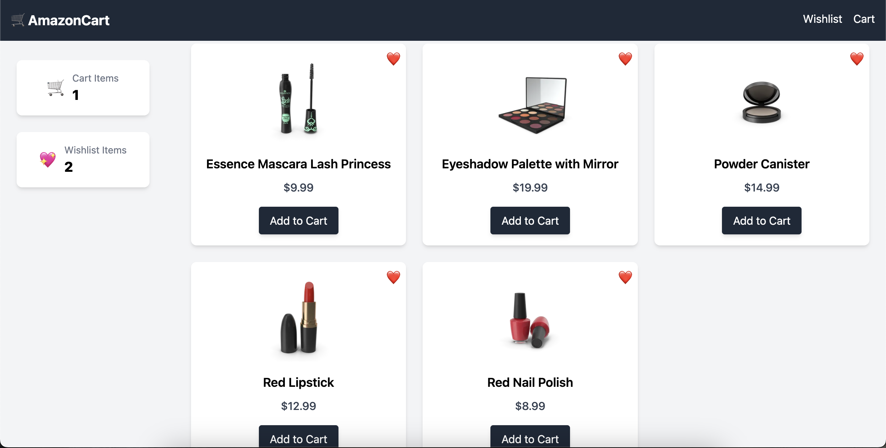
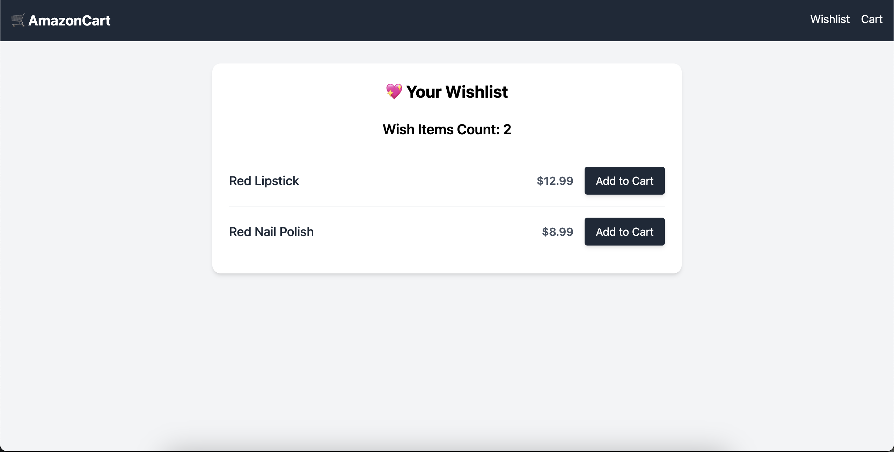
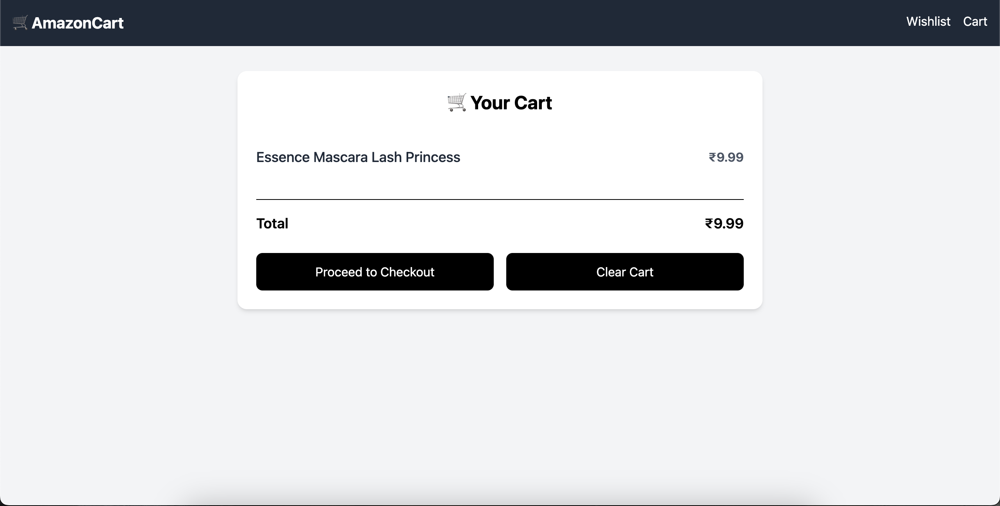

# 🛒 React Cart App

A simple and elegant Amazon-style cart built with **React**, **Recoil** for state management, and deployed using **Vercel**.





---

## Features

- Add items to the cart
- Add items to wishlist
- Load more products from API
- Global state management with Recoil
- Fast deployment with Vercel
- Persistent UI using sticky layout

---

## Tech Stack

- **React** (Vite)
- **Recoil** (State management)
- **Tailwind CSS** (Styling)
- **Axios** (API calls)
- **Vercel** (Hosting)

---

## Preview

Live Demo: [https://react-cart-app.vercel.app](https://react-cart-app.vercel.app)

---

## API Used:

Dummy JSON: [https://dummyjson.com/docs/products](https://dummyjson.com/docs/products)

---

## Installation

1. **Clone the repo**
   ```bash
   git clone https://github.com/tarnija11/react-cart-app.git
   cd react-cart-app

2. **Install Dependencies**
   ```bash
   npm install

2. **Run the App**
   ```bash
   npm run dev
